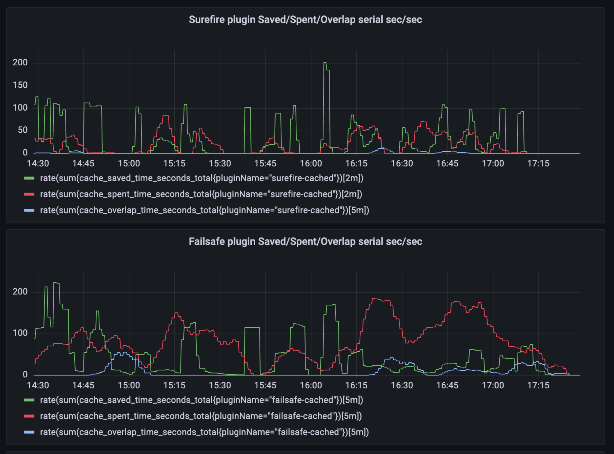

[](https://central.sonatype.com/artifact/com.github.seregamorph/maven-surefire-cached/overview)
[](LICENSE)

# Maven Surefire Cached
This extension wraps standard Maven `surefire` and `failsafe` plugins to support local and remote build caching.

## Comparison with Apache Maven Build Cache Extension
The [Apache Maven Build Cache Extension](https://maven.apache.org/extensions/maven-build-cache-extension/) is an open-source
project adding support of artifact caching to maven, also allowing to skip goal executions via cache.
It can cover a wide range of typical scenarios, however, it's not a good choice for pipelines separating compile and 
test phases. It does not properly handle test reports, does not support flexible test filtering for test distribution 
(caching them separately depending on filtered test subset) for multi-job execution.
Also it does not cache so called CLI executions like `mvn surefire:test`, only lifecycle executions
like `mvn clean verify`, which is also not always convenient especially for large scale projects.

## Adoption
Add to the `.mvn/extensions.xml` of your project:
```xml
<extensions>
    <extension>
        <groupId>com.github.seregamorph</groupId>
        <artifactId>surefire-cached-extension</artifactId>
        <version>0.22</version>
    </extension>
</extensions>
```
This extension will print the cache statistics after the build.

## Module configuration
It's possible to define `surefire-cached.json` file for the module. If the file is not found,
the extension will go thru the parent modules (till root) and try to find it there.

If no configuration is provided, the default configuration is used
```json
{
  "common": {
    "inputIgnoredProperties": [
      "java.version",
      "os.arch",
      "os.name",
      "env.CI",
      "env.GITHUB_BASE_REF",
      "env.GITHUB_REF",
      "env.GITHUB_RUN_ID",
      "env.GITHUB_JOB",
      "env.GITHUB_SHA",
      "project.version"
    ],
    "inputProperties": [
      "java.specification.version"
    ],
    "excludeModules": [],
    "excludeClasspathResources": [
      "META-INF/MANIFEST.MF",
      "META-INF/maven/**/pom.properties",
      "META-INF/maven/**/pom.xml"
    ]
  },
  "surefire": {
    "artifacts": {
      "surefire-reports": {
        "includes": ["surefire-reports/TEST-*.xml"]
      }
    }
  },
  "failsafe": {
    "artifacts": {
      "failsafe-reports": {
        "includes": [
          "failsafe-reports/TEST-*.xml",
          "failsafe-reports/failsafe-summary.xml"
        ]
      }
    }
  }
}
```
`inputProperties` are properties and environment variables (defined with `env.` prefix) that are taken into calculation
of cache entity key. `inputIgnoredProperties` are properties and environment variables that are included as
meta-information for the cache entity, but not taken into calculation of hash. It can be convenient to have all
this meta-information to find the origin of the cache entity (e.g. GitHub pipeline and commit hash that produced it).

It's possible to customize parameters overriding (no appending) default. E.g. specify modules which should be
excluded from hash calculation (like modules with `git.properties` containing build timestamp and commit hash). Or
custom artifacts to be cached (separate for surefire and failsafe):
```json
{
  "common": {
    "//": "Exclude modules with timestamp or git.properties",
    "excludeModules": ["com.acme:module-build-version-timestamp"],
    "excludeClasspathResources": [
      "META-INF/MANIFEST.MF",
      "META-INF/maven/**/pom.properties",
      "META-INF/maven/**/pom.xml",
      "git.properties"
    ]
  },
  "surefire": {
    "artifacts": {
      "surefire-reports": {
        "includes": [
          "surefire-reports/TEST-*.xml",
          "surefire-reports/testng-results.xml"
        ]
      },
      "jacoco": {
        "includes": ["jacoco-surefire.exec"]
      }
    }
  },
  "failsafe": {
    "artifacts": {
      "failsafe-reports": {
        "includes": [
          "failsafe-reports/TEST-*.xml",
          "failsafe-reports/failsafe-summary.xml",
          "failsafe-reports/testng-results.xml"
        ]
      },
      "jacoco": {
        "includes": ["jacoco-failsafe.exec"]
      }
    }
  }
}
```

## Global configuration
It's possible to define global configuration options. These parameters can be specified in `.mvn/maven.config` as
default, or in the maven command line. Configuration parameters should be prefixed 
with `-D` (e.g. `-DcacheExpirationHours=4`). All these parameters are optional and have default value.

Parameters:

| Parameter              | Comment                                                                                      | Default value |
|------------------------|----------------------------------------------------------------------------------------------|---------------|
| `cacheExpirationHours` | Time interval in hours for how long the cache entity is valid. Now used only for s3 storage. | 6             |

## Sample adoption:
* https://github.com/seregamorph/spring-test-smart-context/pull/23
* https://github.com/seregamorph/rest-api-framework/pull/2

## Running with the local cache
Build your project with the extension, the caching will use default file storage `$HOME/.m2/test-cache`
```shell
mvn clean install
```

Or compile separately and run unit tests
```shell
mvn clean install -DskipTests=true
mvn surefire:test
```

Or via phase
```shell
mvn test
```

Then run integration tests of your project
```shell
mvn clean install -DskipTests=true
mvn failsafe:integration-test -Dit.test=SampleIT
```
or via phase
```shell
mvn verify
```

## Running with the remote cache
Run server from this repo
```shell
./mvnw clean install
docker compose up
```

Build your project with the extension using the remote cache
```shell
mvn clean verify -DcacheStorageUrl=http://localhost:8080/cache
```

See also [cache monitoring](#monitoring) chapter.

## Using S3 from Maven
It's possible to access S3 directly from Maven build (no HTTP service required).

First you need to use this extension in `.mvn/extensions.xml` (instead of the regular `surefire-cached-extension`):
```xml
<extensions>
    <extension>
        <groupId>com.github.seregamorph</groupId>
        <artifactId>surefire-cached-extension-s3</artifactId>
        <version>0.22</version>
    </extension>
</extensions>
```

Declare `cacheStorageUrl` property as s3 URI to the bucket:
```shell
mvn clean verify -DcacheStorageUrl=s3://bucketname
```
Other parameters will be obtained from the environment variables (like `AWS_REGION`), system property
(like `aws.region`) or default local AWS profile.

Depending on the authorization provider these environment variables may be used
* `AWS_ACCESS_KEY_ID`
* `AWS_SECRET_ACCESS_KEY`

For the other options (including loading from `~/.aws/credentials`) see
[AWS documentation](https://docs.aws.amazon.com/sdk-for-java/latest/developer-guide/credentials-chain.html)

The entities will be saved in S3 with [cacheExpirationHours](README.md#global-configuration) expiration timeout.

## Reporting
The extension generates text and json reports at the end of the build.
Sample text report:
```
[INFO] Total test cached results (surefire-cached):
[INFO] SUCCESS (5 modules): 2m18s serial time
[INFO] FROM_CACHE (3 modules): 36s serial time saved
[INFO] Cache hit read operations: 9, time: 0.297s, size: 320.00 KB
[INFO] Cache miss read operations: 5, time: 0.022s
[INFO] Cache write operations: 20, time: 0.141s, size: 13.81 MB
```
Json report can be found in `target/surefire-cached-report.json` of the build root module. Sample:
```json
{
  "pluginResults" : {
    "surefire-cached" : {
      "SUCCESS" : {
        "totalModules" : 5,
        "totalTimeSec" : 138.363
      },
      "FROM_CACHE" : {
        "totalModules" : 3,
        "totalTimeSec" : 36.281
      },
      "SKIPPED_CACHE" : {
        "totalModules" : 1,
        "totalTimeSec" : 5.420
      }
    }
  },
  "cacheServiceMetrics" : {
    "readHitOperations" : 9,
    "readMissOperations" : 5,
    "readHitBytes" : 327683,
    "readHitMillis" : 297,
    "readMissMillis" : 22,
    "readFailures" : 0,
    "readSkipped" : 0,
    "writeOperations" : 20,
    "writeBytes" : 14484173,
    "writeMillis" : 141,
    "writeFailures" : 0,
    "writeSkipped" : 0
  }
}
```

## How it works
The extension wraps and replaces default Mojo factory
[DefaultMavenPluginManager](https://github.com/apache/maven/blob/maven-3.9.9/maven-core/src/main/java/org/apache/maven/plugin/internal/DefaultMavenPluginManager.java)
with own implementation [CachedMavenPluginManager](surefire-cached-extension/src/main/java/com/github/seregamorph/maven/test/extension/CachedMavenPluginManager.java).
All mojos are delegating to default behaviour except Surefire and Failsafe plugins. They are wrapped to caching logic,
which calculates task inputs (classpath elements hash codes) and reuses existing cached test result when available.

## Monitoring
If you run a cache server, it's possible to scrape Prometheus metrics via http://localhost:8080/actuator/prometheus

See sample Grafana Dashboard:


Use these queries to build cache dashboards (TODO provide JSON to import to Grafana):
<details>
  <summary>Click to expand</summary>

#### Surefire plugin Saved/Spent/Overlap serial sec/sec
Queries:
* `rate(sum(cache_saved_time_seconds_total{pluginName="surefire-cached"})[2m])`
* `rate(sum(cache_spent_time_seconds_total{pluginName="surefire-cached"})[2m])`
* `rate(sum(cache_overlap_time_seconds_total{pluginName="surefire-cached"})[2m])`

#### Failsafe plugin Saved/Spent/Overlap serial sec/sec
Queries:
* `rate(sum(cache_saved_time_seconds_total{pluginName="failsafe-cached"})[2m])`
* `rate(sum(cache_spent_time_seconds_total{pluginName="failsafe-cached"})[2m])`
* `rate(sum(cache_overlap_time_seconds_total{pluginName="failsafe-cached"})[2m])`

#### Reads/writes MB/sec
Queries:
* reads `rate(sum(get_cache_size_total)[2m])/1048576`
* writes `rate(sum(put_cache_size_total)[2m])/1048576`

</details>

## Related projects
### Turbo reactor
The default Maven multi-module build does not do an efficient multi-core CPU utilization.
See [turbo-builder](https://github.com/seregamorph/maven-turbo-reactor) for more details. This extension is
compatible with `maven-surefire-cached` extension.

### Test distribution
By default Maven executes unit and integration tests (via surefire and failsafe plugins) in a single execution,
however at large scale it makes sense to split huge test suites to smaller pieces (test distribution).
See [test-distribution](https://github.com/seregamorph/test-distribution) for more details. This extension
is also compatible with `maven-surefire-cached` extension.
